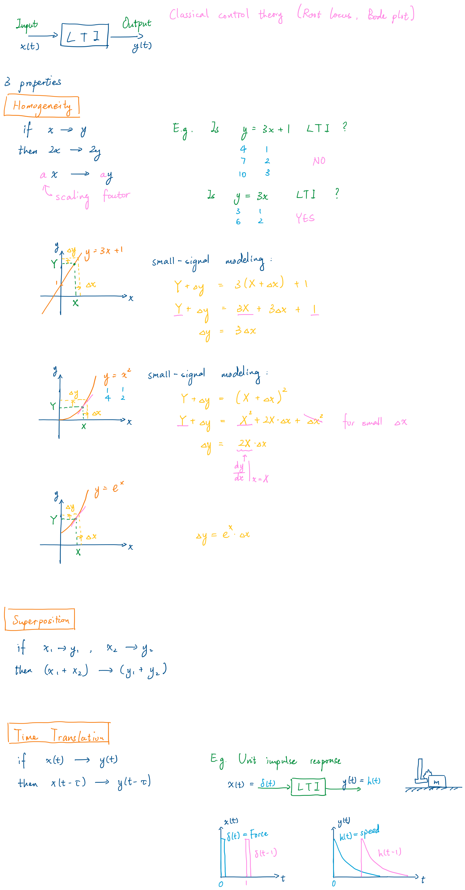
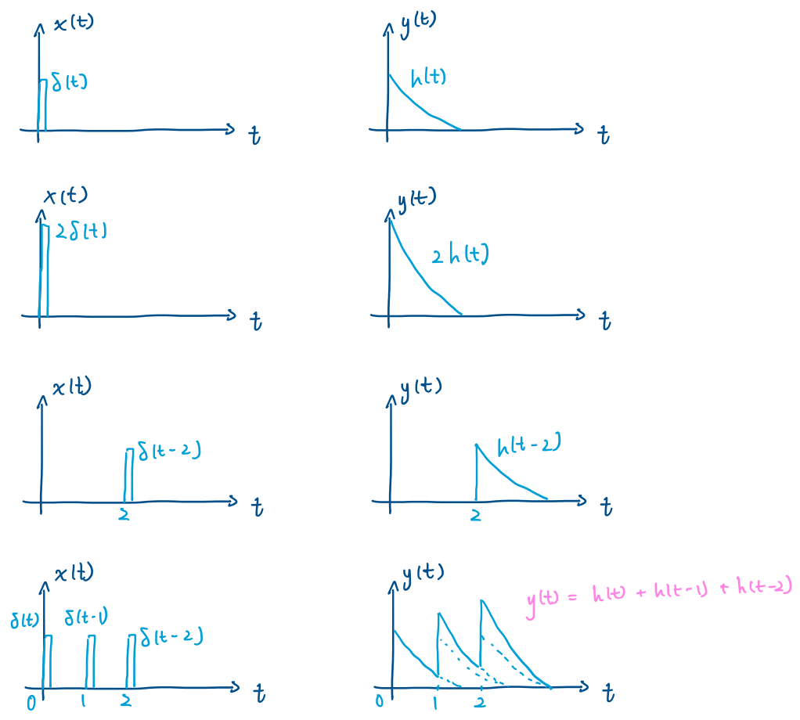
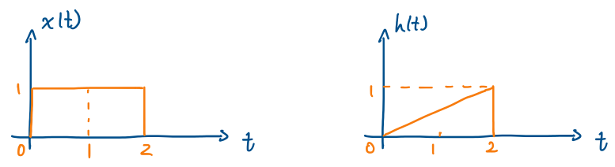

# Convolution

## Linear Time-Invariant (LTI) Systems



## Convolution

\begin{equation}
    h(t) * x(t) = \int_{-\infty}^{\infty} x(\tau)h(t-\tau) \,d\tau
\end{equation}

```{.tikz}
\begin{tikzpicture}[>=latex, thick]
  \node[draw, minimum width=2.2cm, minimum height=1cm] (sys) {$LTI$};

  \draw[->] (-3,0) -- (sys.west);
  \draw[->] (sys.east) -- (3,0);

  \node[above] at (-2.5,0) {$x(t)$};
  \node[above] at (2.5,0) {$y(t)=x(t) * h(t)$};
  \node[below] at (sys.south) {$h(t)$};
\end{tikzpicture}
```

where $h(t)$ is the unit impulse response: $\begin{cases}\text{when } x(t) = \delta(t)\\\text{then } y(t) = h(t)\end{cases}$

{width=400}

$$ \int_{-\infty}^{\infty} h(t) \,dt = 1.  \qquad y(t) = \delta(0) \cdot h(t) + \delta(1) \cdot h(t-1) + \delta(2) \cdot h(t-2) .$$

For LTI system, $y(t)$ is the sum of the scaled unit impulse response of $x(t)$ at each time instant $\tau$.
$$y(t) = \int_{-\infty}^{\infty} x(\tau)h(t-\tau) \,d\tau$$
where $x(\tau)$ is the scaling factor at $t=\tau$, and $h(t-\tau)$ is the unit impulse response at $t=\tau$.

For a continuous $x(t) with $h(t) = \dfrac{1}{2}t$, ($0 \le t \le 2$), what is $y(t)$?
{width=400}

<!-- ```{python}
import numpy as np
import matplotlib.pyplot as plt

t = np.linspace(0, 2, 100)
h = 0.5 * t

fig, axs = plt.subplots(3, 2, figsize=(8, 8))

axs[0, 0].plot(t, h)
# axs[0, 0].set_title("Impulse Response h(t)")
axs[0, 0].set_xlabel("Time (t)")
axs[0, 0].set_ylabel("$x(t)$")
plt.grid("off")
plt.show()
``` -->

Time domain convolution compuation is expensive, and it can be simplified by using Fourier transform to transfer **convolution** in *time domain* to **multiplication** in *frequency domain*.

$$\text{Time domain} \underset{\text{F. T.}}{\overset{\text{Fourier Transform}}{\longrightarrow}} \text{Frequency domain}$$

$$\text{F. T.:}\quad Y(\omega) = \int_{-\infty}^{\infty} y(t) e^{-j\omega t} \,dt$$

*Proof*: $\mathcal{F}[f(t) * g(t)] = F(\omega) \cdot G(\omega)$.

\begin{align*}
\mathcal{F}[f(t) * g(t)] &= \int_{-\infty}^{\infty} \left(\int_{-\infty}^{\infty} f(\tau)g(t-\tau) \,d\tau\right) \cdot e^{-j\omega t} \,dt \\
&= \int_{-\infty}^{\infty} \int_{-\infty}^{\infty} f(\tau) \cdot g(t-\tau) \cdot e^{-j\omega t} \,d\tau dt \\
&= \int_{-\infty}^{\infty} f(\tau) \left( \int_{-\infty}^{\infty} g(t-\tau) e^{-j\omega t} \,dt \right) d\tau \\
&= \int_{-\infty}^{\infty} f(\tau) \cdot e^{-j\omega \tau} \cdot G(\omega) \,d\tau \tag{see note below} \\
&= G(\omega) \cdot \int_{-\infty}^{\infty} f(\tau) e^{-j\omega \tau} \,d\tau \\
&= F(\omega) \cdot G(\omega)
\end{align*}
 
Note that:
\begin{align*}
    \mathcal{F}[g(t)] &= G(\omega) \\
    \mathcal{F}[g(t-\tau)] &= \int_{-\infty}^{\infty} g(t-\tau) e^{-j\omega t} \,dt \\
    &= \int_{-\infty}^{\infty} g(t-\tau) e^{-j\omega (t-\tau)} \,dt \cdot e^{-j\omega \tau} \\
    &= \int_{-\infty}^{\infty} g(u) e^{-j\omega u} \,du \cdot e^{-j\omega \tau} \tag{let $u = t-\tau$} \\
    &= e^{-j\omega \tau} \cdot G(\omega)
\end{align*}
